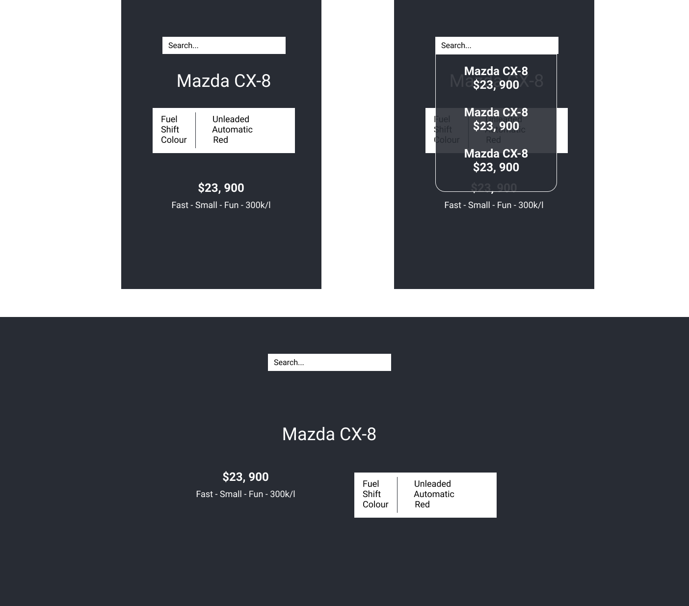

# Super Cars 🚗

#### Technologies: React, HTML, CSS

[Setup](#Setup) | [Acceptance Criteria](#Acceptance_Criteria) | [Design](#Design)


## <a name="Setup">Setup</a>

First, clone this repository. Then:

```
> npm install # Get dependencies
> npm start # Build and serve the application on `localhost:3000`
```
To run tests:
```
> npm test # Run the tests
```

## <a name="Acceptance_Criteria">Acceptance Criteria</a>

## Create a search component
- When the user types into the search box
- It should use the `findCars(searchTerm)` function to display a list of matched cars
- These results should be displayed under the search box

## Show selected car
- When the user clicks on a car in the search box
- It should use the `getCar(make, model)` method to get the full details for the chosen car
- These details should be shown below the search bar in a format similar to that in the designs provided

## <a name="Design">Design</a>


